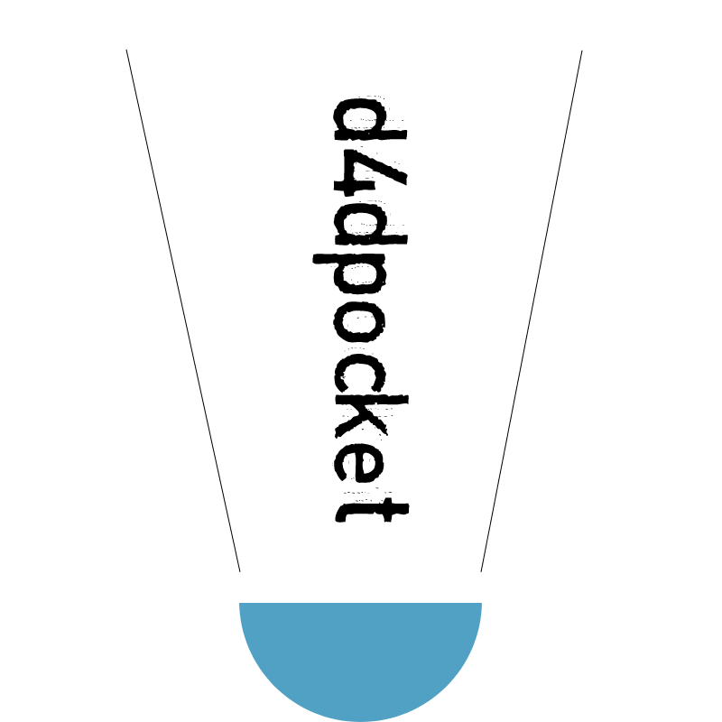

<p align="center">
  
<p>

<h2 align="center">Doraemon's 4D Pocket for React Native</h2>

<p align="center">
  <a href="https://www.npmjs.com/package/d4dpocket"></a>
  <a href="https://github.com/tuantvk/d4dpocket"></a>
  <a href="https://github.com/tuantvk/d4dpocket"></a>
  <a href="https://github.com/tuantvk/d4dpocket"></a>
  <a href="https://github.com/prettier/prettier"></a>
  <a href="https://opensource.org/licenses/MIT"></a>
</p>

# Installation

```sh
yarn add d4dpocket
```

# Usage

```js
// Example
import { isIphoneX } from 'd4dpocket';
```

### scale
Use for padding, margin, size, fontSize, borderRadius, ....
```js
padding: scale(10)
```

### wScale
Use for width
```js
width: wScale(100)
```

### hScale
Use for height
```js
height: hScale(100)
```

### RFValue
Use for font size
```js
fontSize: RFValue(16)
```

### StylePlatforms
```js
const styles = StyleSheet.create({
  box: {
    ...StylePlatforms({
      tablet: {
        width: 20,
      },
      iPad: {
        width: 25,
        backgroundColor: 'grey',
      },
      iPhoneX: {
        width: 18,
        backgroundColor: 'grey',
      },
      base: {
        width: 15,
      },
    }),
  },
});
```

### isIphoneX
```js
if (isIphoneX()) {
  console.log("isIphoneX");
}
```

### isTablet
```js
if (isTablet()) {
  console.log("isTablet");
}
```

### isNewerVersion
Compare software version
```js
isNewerVersion("1.0.1", "1.0.10") // true
```

### isUUID
```js
isUUID("9b1deb4d-3b7d-4bad-9bdd-2b0d7b3dcb6d");
// true
```

### toVnd
Format string to Vnd
```js
toVnd("1000000"); // 1,000,000
```

### limitedString
Default: `limitedString(string, maxLength = 9)`
```js
limitedString("Lorem Ipsum is simply dummy text of the printing and typesetting industry");
// Lorem Ipsum is simply dummy text of the printing...
```

### formatComma
Default: `formatComma(string, toFixed = 2)`
```js
formatComma("100000");
// 100,000
```

### removeAccent
Remove accent in vietnamese
```js
removeAccent("chấm và hỏi");
// cham va hoi
```

## Components

### Button
Inherits [TouchableOpacity](https://reactnative.dev/docs/next/touchableopacity)
```jsx
<Button>Button</Button>
```

### KeyboardSpacer
Inherits [react-native-keyboard-spacer](https://github.com/Andr3wHur5t/react-native-keyboard-spacer)
```jsx
<KeyboardSpacer>{children}</KeyboardSpacer>
```

### ScrollView
Inherits [ScrollView](https://reactnative.dev/docs/next/scrollview)
```jsx
<ScrollView>{children}</ScrollView>
```

### src/scripts/createChangeEnv.js
Generate file bash script change env
```sh
node node_modules/d4dpocket/src/scripts/createChangeEnv.js 'env' 'app_name' 'package_name'
```
Example
```sh
node node_modules/d4dpocket/src/scripts/createChangeEnv.js 'dev' 'ABC' 'com.abc.dev'
```
File `change-[dev].sh` generated in root project

Run
```sh
bash change-dev.sh
```

# Running the example app

1. Run `yarn` in repo root
2. Run `yarn example android` or `yarn example ios`
3. Run `yarn example start` to start Metro Bundler

# Contributing

See the [contributing guide](CONTRIBUTING.md) to learn how to contribute to the repository and the development workflow.

# License

[MIT](LICENSE)
